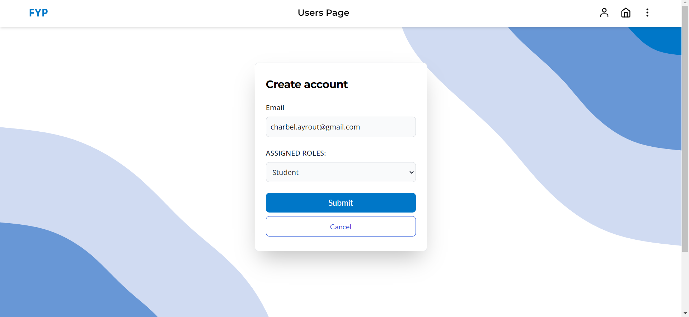
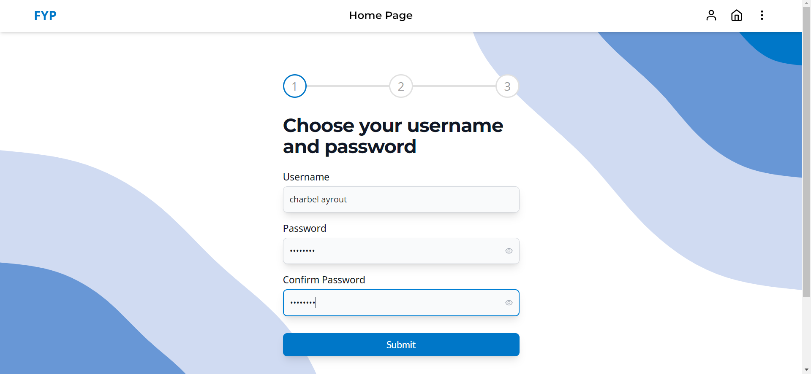
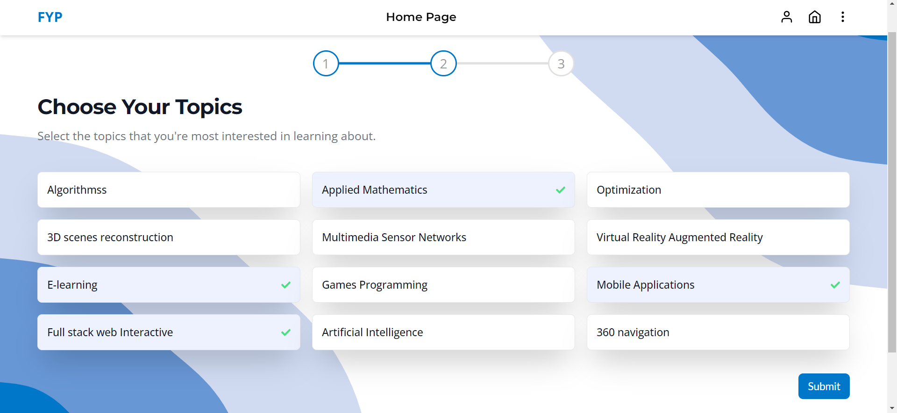
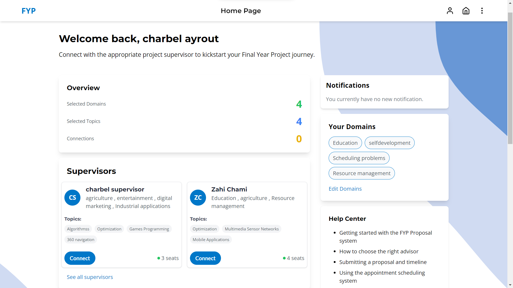
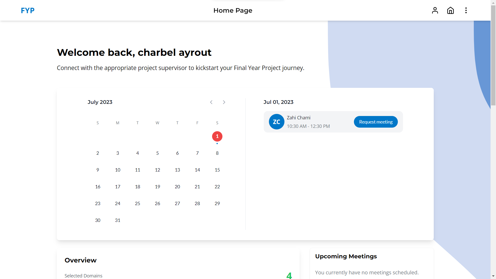
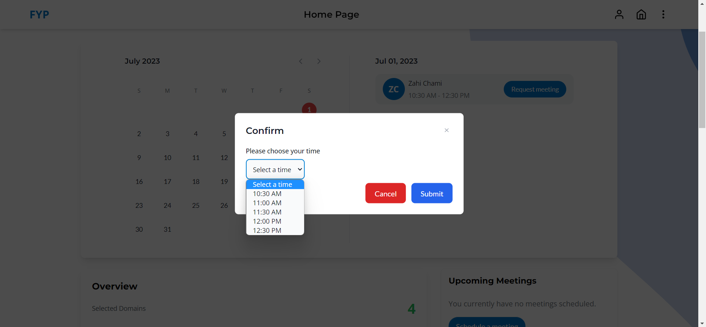
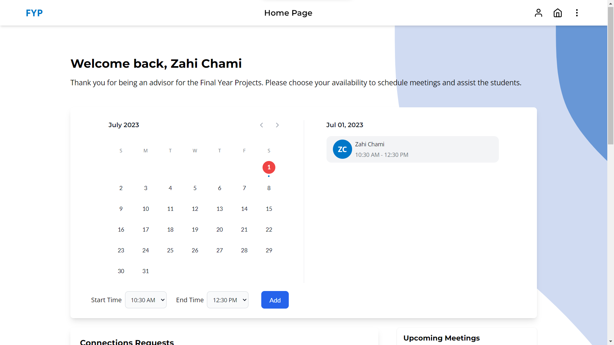

# FYP Proposal Management System

## Description
This GitHub project proposes a user-friendly and efficient management system tailored for Antonine University's Final Year Project (FYP) process. The web application offers features to streamline FYP proposals, including a regularly updated advisors directory with real-time availability, a central communication platform for students and supervisors, and a recommendation function to match students with suitable advisors based on interests and project needs. By addressing challenges faced by fifth-year engineering students, this system aims to enhance the FYP experience at Antonine University.

Live Version: https://fyp-schedule.onrender.com/

Backend Github Repository: https://github.com/charbel-ayrouth/FYP-backend

## Functionalities by User Role

### Admin
- View / Add / Edit / Delete user accounts.
- Disable / Enable user accounts.
- View / Add / Edit / Delete topics of interest and domains of application.

### Student
- Select domains of application.
- Select topics of interest.
- Browse recommended or all supervisors.
- Connect with supervisor and send messages.
- Schedule a meeting by choosing a time slot from the supervisor's calendar.
- Browse notifications, filter by date.

### Supervisor
- Select domains of application.
- Select topics of interest.
- Choose available time and date for meetings.
- Accept / Decline connection requests.
- Browse notifications, filter by date.

## App Flow

To ensure better consistency I implemented a structured flow, the flow begins with the admin creating a user account for either a student or supervisor, with a default password assigned.

When users log in for the time they are asked to complete a three step form. The system remembers your progress, so you can log in and continue setting up your profile without starting over.

After completing the required steps, the user is taken to a personalized dashboard that provides a comprehensive overview. 

For student, the dashboard initially excludes the calendar view until successfully connected to a supervisor. Once connected, you'll see a calendar showing supervisor availability at the top of the page. 

In contrast, the dashboard has a specific calendar option for users of type supervisor.

